## Documentation for Project 1

`sudo apt update`

`sudo apt install apache2`

`sudo systemctl apache2`

## Apache Server Test Page
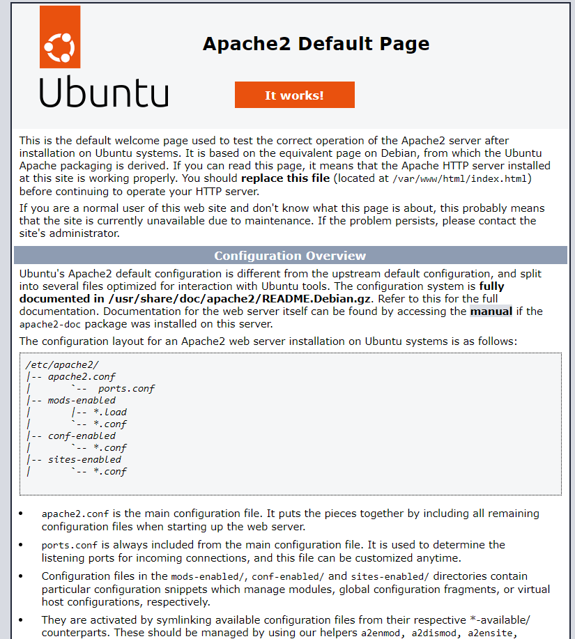

`sudo apt install mysql-server`

`sudo mysql`

`sudo mysql_secure_installation`

`sudo mysql -p`
## mysql server success output

## mysql security script output
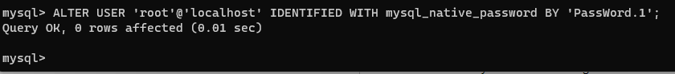

## mysql password config success
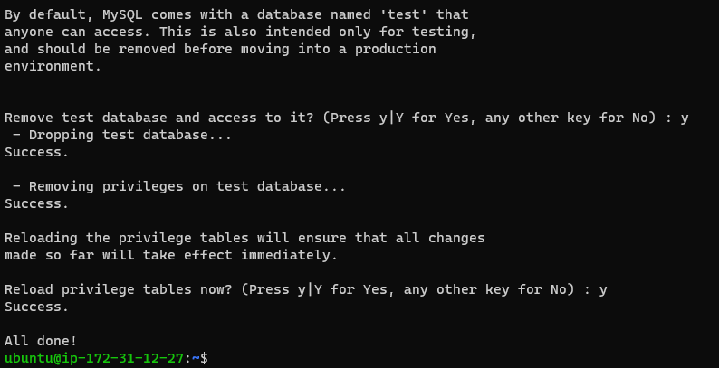

## mysql successful connection output
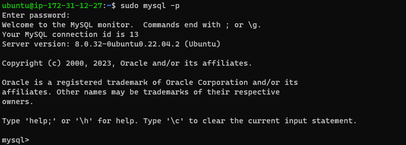

## Php Setup
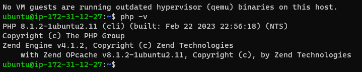

## Creating a virtualhost for my website using apache
`sudo mkdir /var/www/projectlamp`
`sudo chown -R $USER:$USER /var/www/projectlamp`
`sudo vi /etc/apache2/sites-available/projectlamp.conf`
`sudo ls /etc/apache2/sites-available`
## Serving Project Lamp on Apache
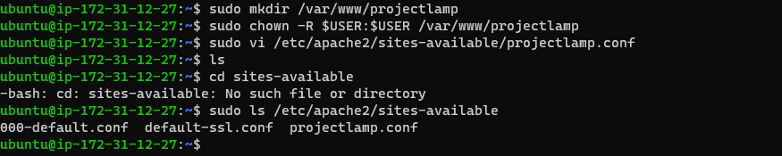
## Enabling the new Virtual Host
`sudo a2ensite projectlamp`
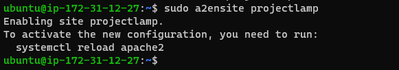

## Disabling Default website that comes with apache
`sudo a2dissite 000-default`
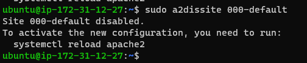

## Configuration file syntax error check
`sudo apache2ctl configtest`
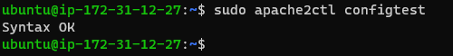

## Effecting Changes
`sudo systemctl reload apache2`
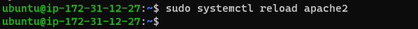

## Testing VirtualHost with Index.html FIle
`sudo echo 'Hello LAMP from hostname' $(curl -s http://169.254.169.254/latest/meta-data/public-hostname) 'with public IP' $(curl -s http://169.254.169.254/latest/meta-data/public-ipv4) > /var/www/projectlamp/index.html`
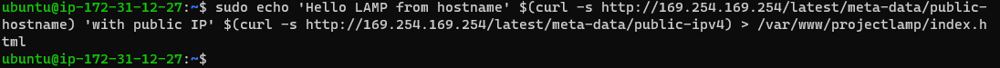

## Echo Command Output on Browser using public address
`http://<Public-DNS-Name>:80`
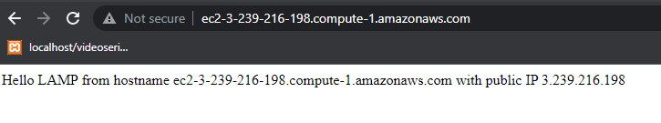