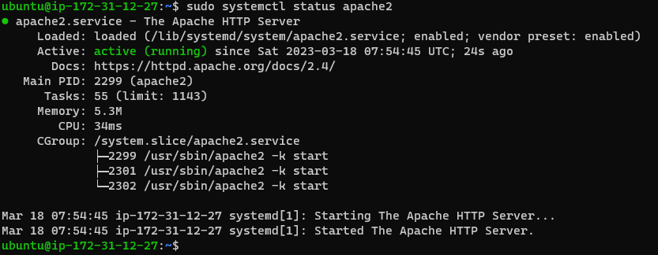

## Documentation for Project 1

`sudo apt update`

`sudo apt install apache2`

`sudo systemctl apache2`

## Apache Server Test Page

## mysql server success output

## mysql security script output

## mysql password config success

## mysql successful connection output
